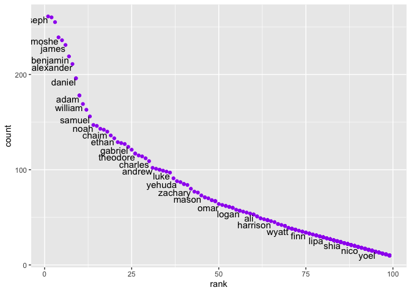

p8105\_hw2\_mk4208
================
Meeraj Kothari
3/10/2019

##### Loading required packages

``` r
library(tidyverse)
```

    ## ── Attaching packages ─────────────────────────────────────────────────────────── tidyverse 1.2.1 ──

    ## ✔ ggplot2 3.2.1     ✔ purrr   0.3.2
    ## ✔ tibble  2.1.3     ✔ dplyr   0.8.3
    ## ✔ tidyr   1.0.0     ✔ stringr 1.4.0
    ## ✔ readr   1.3.1     ✔ forcats 0.4.0

    ## ── Conflicts ────────────────────────────────────────────────────────────── tidyverse_conflicts() ──
    ## ✖ dplyr::filter() masks stats::filter()
    ## ✖ dplyr::lag()    masks stats::lag()

``` r
library(readxl)
```

# Problem 1

Importing Mr. Trash Wheel sheet and omitting non-data entries. Rows that
do not include dumpster-specific data have been omitted. Number of
sports balls have been rounded the nearest integer and the result has
been converted to a numeric variable.

``` r
trashwheel =
  read_excel(path="./Data/Trash-Wheel-Collection-Totals-8-6-19.xlsx",
             sheet = 1,
             range ="A2:N408") %>% 
  janitor::clean_names() %>% 
  drop_na(dumpster) %>% 
  mutate(sports_balls = round(sports_balls, digits = 0)) %>% 
  mutate(sports_balls = as.integer(sports_balls))
```

## Precipitation data for 2018:

Rows without precipitation data have been omitted. Year variable has
been added.

``` r
precipitation_2018 = 
  read_excel(path="./Data/HealthyHarborWaterWheelTotals2018-7-28.xlsx", 
                        sheet = 3,
                        range ="A2:B14") %>% 
  janitor::clean_names()  %>%
  drop_na(total) %>% 
  mutate(year = 2018)
```

## Precipitation data for 2017:

Rows without precipitation data have been omitted. Year variable has
been added.

``` r
precipitation_2017 = 
  read_excel(path="./Data/HealthyHarborWaterWheelTotals2018-7-28.xlsx", 
                        sheet = 4,
                        range ="A2:B14") %>% 
  janitor::clean_names()  %>%
  drop_na(total) %>% 
  mutate(year = 2017)
```

Precipitation data for 2018 and 2017 have been merged and month name has
been converted to a character
variable.

``` r
precipitation_full = full_join(precipitation_2017, precipitation_2018) %>% 
  mutate(month = month.name[month])
```

    ## Joining, by = c("month", "total", "year")

## Here is a short description of the 2 datasets:

###### For the precipitation dataset:

  - There are **19 observations**.
  - It contains the following variables: **month, total, year**.
  - The total precipitation in the year 2018 was **23.5**.

###### For the Mr. Trash Wheel dataset,

  - There are **344 observations**.
  - It contains the following variables: **dumpster, month, year, date,
    weight\_tons, volume\_cubic\_yards, plastic\_bottles, polystyrene,
    cigarette\_butts, glass\_bottles, grocery\_bags, chip\_bags,
    sports\_balls, homes\_powered**.
  - The median number of sports balls in a dumpster in 2017 was **8**.

<!-- end list -->

``` r
pols = read_csv("./Data/fivethirtyeight_datasets/pols-month.csv") %>% 
  separate(mon,
    c("year", "month", "day"), 
    convert = TRUE) %>% 
  mutate(prez_dem = recode(prez_dem, '1' = "dem")) %>% 
  mutate(prez_gop = recode(prez_gop, '1' = "gop")) %>% 
  pivot_longer(
    c("prez_dem", "prez_gop"), 
    values_to = "president", 
    values_drop_na = TRUE
  ) %>% 
  mutate(month = month.name[month]) %>% 
  select(-day)
```

    ## Parsed with column specification:
    ## cols(
    ##   mon = col_date(format = ""),
    ##   prez_gop = col_double(),
    ##   gov_gop = col_double(),
    ##   sen_gop = col_double(),
    ##   rep_gop = col_double(),
    ##   prez_dem = col_double(),
    ##   gov_dem = col_double(),
    ##   sen_dem = col_double(),
    ##   rep_dem = col_double()
    ## )

    ## Warning: Unreplaced values treated as NA as .x is not compatible. Please
    ## specify replacements exhaustively or supply .default
    
    ## Warning: Unreplaced values treated as NA as .x is not compatible. Please
    ## specify replacements exhaustively or supply .default

``` r
snp = read_csv("./Data/fivethirtyeight_datasets/snp.csv") %>% 
  separate(date, 
           c("month", "day", "year"),
           convert = TRUE) %>%
  mutate(month = month.name[month]) %>% 
  select(year, month, -day, everything())
```

    ## Parsed with column specification:
    ## cols(
    ##   date = col_character(),
    ##   close = col_double()
    ## )

``` r
unemployment = read_csv("./Data/fivethirtyeight_datasets/unemployment.csv") %>% 
  pivot_longer(Jan:Dec, 
    names_to = "month",
    values_to = "rate"
  ) %>% 
  mutate(month = match(month, month.abb)) %>% 
  mutate(month = month.name[month]) %>%
  mutate(Year = as.integer(Year)) %>%
  janitor::clean_names()
```

    ## Parsed with column specification:
    ## cols(
    ##   Year = col_double(),
    ##   Jan = col_double(),
    ##   Feb = col_double(),
    ##   Mar = col_double(),
    ##   Apr = col_double(),
    ##   May = col_double(),
    ##   Jun = col_double(),
    ##   Jul = col_double(),
    ##   Aug = col_double(),
    ##   Sep = col_double(),
    ##   Oct = col_double(),
    ##   Nov = col_double(),
    ##   Dec = col_double()
    ## )

``` r
merged_data = pols %>% 
  left_join(snp, 
    by = c("year", "month") 
  ) %>% 
  left_join(
    unemployment,
    by = c("year", "month")
    )
```

# Problem 3:

Loading the popular baby names dataset. Recoding the inconsistent
ethinicity observations. Fixing the case structure of string varaibles.
Removing duplicates using the distinct() function.

``` r
popular_baby_names = read_csv("./Data/Popular_Baby_Names.csv") %>%
  janitor::clean_names() %>% 
  mutate(ethnicity = recode(ethnicity, "ASIAN AND PACI" = "ASIAN AND PACIFIC ISLANDER",
                            "WHITE NON HISP" = "WHITE NON HISPANIC",
                            "BLACK NON HISP" = "BLACK NON HISPANIC")) %>% 
  mutate(childs_first_name = str_to_lower(childs_first_name),
         ethnicity = str_to_lower(ethnicity), 
         gender = str_to_lower(gender)) %>% 
  distinct()
```

    ## Parsed with column specification:
    ## cols(
    ##   `Year of Birth` = col_double(),
    ##   Gender = col_character(),
    ##   Ethnicity = col_character(),
    ##   `Child's First Name` = col_character(),
    ##   Count = col_double(),
    ##   Rank = col_double()
    ## )

Following table shows the rank in popularity of the name “Olivia” as a
female baby name over time. Rows contain ethnicities and columns contain
year.

``` r
popular_baby_names %>% 
  filter(childs_first_name == "olivia") %>% 
  select(-count) %>%
  pivot_wider(
    names_from = "year_of_birth",
    values_from = "rank"
  ) %>% 
  knitr::kable()
```

| gender | ethnicity                  | childs\_first\_name | 2016 | 2015 | 2014 | 2013 | 2012 | 2011 |
| :----- | :------------------------- | :------------------ | ---: | ---: | ---: | ---: | ---: | ---: |
| female | asian and pacific islander | olivia              |    1 |    1 |    1 |    3 |    3 |    4 |
| female | black non hispanic         | olivia              |    8 |    4 |    8 |    6 |    8 |   10 |
| female | hispanic                   | olivia              |   13 |   16 |   16 |   22 |   22 |   18 |
| female | white non hispanic         | olivia              |    1 |    1 |    1 |    1 |    4 |    2 |

Follwing table shows the most popular name among male children over
time.

``` r
popular_baby_names %>% 
  filter(gender == "male") %>% 
  filter(rank == 1) %>%
  select(-count) %>% 
  pivot_wider(
    names_from = "year_of_birth",
    values_from = "childs_first_name"
  ) %>% 
  knitr::kable()
```

| gender | ethnicity                  | rank | 2016   | 2015   | 2014   | 2013   | 2012   | 2011    |
| :----- | :------------------------- | ---: | :----- | :----- | :----- | :----- | :----- | :------ |
| male   | asian and pacific islander |    1 | ethan  | jayden | jayden | jayden | ryan   | ethan   |
| male   | black non hispanic         |    1 | noah   | noah   | ethan  | ethan  | jayden | jayden  |
| male   | hispanic                   |    1 | liam   | liam   | liam   | jayden | jayden | jayden  |
| male   | white non hispanic         |    1 | joseph | david  | joseph | david  | joseph | michael |

##### For male, white non-hipsanic children born in 2016:

Following is a scatter plot showing the number of children with a name
(y axis) against the rank in popularity of that name (x axis)

``` r
popular_baby_names %>% 
  filter(gender ==  "male", 
         ethnicity == "white non hispanic", 
         year_of_birth == 2016) %>%
  ggplot(aes(x = rank, y = count)) +
  geom_point(colour = "blue") + 
  geom_text(aes(label = childs_first_name),
            hjust = 1, 
            vjust = 1, 
            check_overlap = TRUE,
            size = 2.4)
```

<!-- -->
