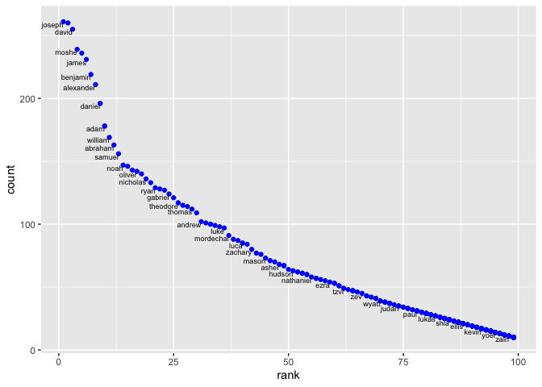

p8105\_hw2\_mk4208
================
Meeraj Kothari
3/10/2019

##### Loading required packages

``` r
library(tidyverse)
library(readxl)
```

# Problem 1

Importing Mr. Trash Wheel sheet and omitting non-data entries. Rows that
do not include dumpster-specific data have been omitted. Number of
sports balls have been rounded the nearest integer and the result has
been converted to a numeric variable.

``` r
trashwheel =
  read_excel(path="./Data/Trash-Wheel-Collection-Totals-8-6-19.xlsx",
             sheet = 1,
             range ="A2:N408") %>% 
  janitor::clean_names() %>% 
  drop_na(dumpster) %>% 
  mutate(sports_balls = round(sports_balls, digits = 0)) %>% 
  mutate(sports_balls = as.integer(sports_balls))
```

## Here is a short description of the dataset:

###### For the Mr. Trash Wheel dataset,

  - There are **344 observations**.
  - It contains the following variables: **dumpster, month, year, date,
    weight\_tons, volume\_cubic\_yards, plastic\_bottles, polystyrene,
    cigarette\_butts, glass\_bottles, grocery\_bags, chip\_bags,
    sports\_balls, homes\_powered**.
  - The median number of sports balls in a dumpster in 2017 was **8**.

## Precipitation data for 2018:

Rows without precipitation data have been omitted. Year variable has
been added.

``` r
precipitation_2018 = 
  read_excel(path="./Data/HealthyHarborWaterWheelTotals2018-7-28.xlsx", 
                        sheet = 3,
                        range ="A2:B14") %>% 
  janitor::clean_names()  %>%
  drop_na(total) %>% 
  mutate(year = 2018)
```

## Precipitation data for 2017:

Rows without precipitation data have been omitted. Year variable has
been added.

``` r
precipitation_2017 = 
  read_excel(path="./Data/HealthyHarborWaterWheelTotals2018-7-28.xlsx", 
                        sheet = 4,
                        range ="A2:B14") %>% 
  janitor::clean_names()  %>%
  drop_na(total) %>% 
  mutate(year = 2017)
```

Precipitation data for 2018 and 2017 have been merged and month name has
been converted to a character
variable.

``` r
precipitation_full = full_join(precipitation_2017, precipitation_2018) %>% 
  mutate(month = month.name[month])
```

## Here is a short description of the dataset:

###### For the precipitation dataset:

  - There are **19 observations**.
  - It contains the following variables: **month, total, year**.
  - The total precipitation in the year 2018 was **23.5**.

-----

## Loading `pols`, `snp` and `unemployment` datasets…

### For the `pols` dataset:

The month variable is separated into “year”, “month” and “day”. A new
variable “President” has been added taking values from prez\_dem and
prez\_gop. The values of the month variable have been converted to
characters. Day variable has been removed.

``` r
pols = read_csv("./Data/fivethirtyeight_datasets/pols-month.csv") %>% 
  separate(mon,
    c("year", "month", "day"), 
    convert = TRUE) %>% 
  mutate(prez_dem = recode(prez_dem, '1' = "dem")) %>% 
  mutate(prez_gop = recode(prez_gop, '1' = "gop", '2' = "gop")) %>% 
  pivot_longer(
    cols = c("prez_dem", "prez_gop"), 
    values_to = "president", 
    values_drop_na = TRUE
  ) %>% 
  mutate(month = month.name[month]) %>% 
  select(-day, -name)
```

##### Here is a short description of the dataset:

  - There are **822 observations** and **9 columns**.
  - The range of years is from **1947 to 2015**.
  - It contains the following variables: **year, month, gov\_gop,
    sen\_gop, rep\_gop, gov\_dem, sen\_dem, rep\_dem, president**.

### For the `snp` dataset:

The date variable is separated into “month”, “day” and “year”. The
values of the month variable have been converted to characters. The year
and month variables have been rearranged. Day variable has been removed.

``` r
snp = read_csv("./Data/fivethirtyeight_datasets/snp.csv") %>% 
  separate(date, 
           c("month", "day", "year"),
           convert = TRUE) %>%
  mutate(month = month.name[month]) %>% 
  select(year, month, -day, everything())
```

##### Here is a short description of the dataset:

  - There are **787 observations** and **4 columns**.
  - The range of years is from **1950 to 2015**.
  - It contains the following variables: **year, month, day, close**.

### For the `unemployment` dataset:

A new variable month has been created taking values from the Jan to Dec
column names. The month variable has been formatted to character
variable using month,name. Year variable has been converted to
integer.

``` r
unemployment = read_csv("./Data/fivethirtyeight_datasets/unemployment.csv") %>% 
  pivot_longer(Jan:Dec, 
    names_to = "month",
    values_to = "rate"
  ) %>% 
  mutate(month = match(month, month.abb)) %>%
  mutate(month = month.name[month]) %>%
  mutate(Year = as.integer(Year)) %>%
  janitor::clean_names()
```

##### Here is a short description of the dataset:

  - There are **816 observations** and **3 columns**.
  - The range of years is from **1948 to 2015**.
  - It contains the following variables: **year, month, rate**.

-----

The following code chunk merges `snp` into `pols` and then
`unexmployment` into the result.

``` r
merged_data = pols %>% 
  left_join(snp, 
            by = c("year", "month")) %>%
  left_join(unemployment, 
            by = c("year", "month"))
```

##### Here is a short description of the dataset:

###### For the merged dataset:

  - There are **822 observations** and **12 columns**.
  - The range of years is from **1947 to 2015**.
  - It contains the following variables: **year, month, gov\_gop,
    sen\_gop, rep\_gop, gov\_dem, sen\_dem, rep\_dem, president, day,
    close, rate**.

# Problem 3:

Loading the popular baby names dataset. Recoding the inconsistent
ethinicity observations. Fixing the case structure of string varaibles.
Removing duplicates using the distinct() function.

``` r
popular_baby_names = read_csv("./Data/Popular_Baby_Names.csv") %>%
  janitor::clean_names() %>% 
  mutate(ethnicity = recode(ethnicity, "ASIAN AND PACI" = "ASIAN AND PACIFIC ISLANDER",
                            "WHITE NON HISP" = "WHITE NON HISPANIC",
                            "BLACK NON HISP" = "BLACK NON HISPANIC")) %>% 
  mutate(childs_first_name = str_to_lower(childs_first_name),
         ethnicity = str_to_lower(ethnicity), 
         gender = str_to_lower(gender)) %>% 
  distinct()
```

Following table shows the rank in popularity of the name “Olivia” as a
female baby name over time. Rows contain ethnicities and columns contain
year.

``` r
popular_baby_names %>% 
  filter(childs_first_name == "olivia") %>% 
  select(-count) %>%
  pivot_wider(
    names_from = "year_of_birth",
    values_from = "rank"
  ) %>% 
  knitr::kable()
```

| gender | ethnicity                  | childs\_first\_name | 2016 | 2015 | 2014 | 2013 | 2012 | 2011 |
| :----- | :------------------------- | :------------------ | ---: | ---: | ---: | ---: | ---: | ---: |
| female | asian and pacific islander | olivia              |    1 |    1 |    1 |    3 |    3 |    4 |
| female | black non hispanic         | olivia              |    8 |    4 |    8 |    6 |    8 |   10 |
| female | hispanic                   | olivia              |   13 |   16 |   16 |   22 |   22 |   18 |
| female | white non hispanic         | olivia              |    1 |    1 |    1 |    1 |    4 |    2 |

Follwing table shows the most popular name among male children over
time.

``` r
popular_baby_names %>% 
  filter(gender == "male") %>% 
  filter(rank == 1) %>%
  select(-count) %>% 
  pivot_wider(
    names_from = "year_of_birth",
    values_from = "childs_first_name"
  ) %>% 
  knitr::kable()
```

| gender | ethnicity                  | rank | 2016   | 2015   | 2014   | 2013   | 2012   | 2011    |
| :----- | :------------------------- | ---: | :----- | :----- | :----- | :----- | :----- | :------ |
| male   | asian and pacific islander |    1 | ethan  | jayden | jayden | jayden | ryan   | ethan   |
| male   | black non hispanic         |    1 | noah   | noah   | ethan  | ethan  | jayden | jayden  |
| male   | hispanic                   |    1 | liam   | liam   | liam   | jayden | jayden | jayden  |
| male   | white non hispanic         |    1 | joseph | david  | joseph | david  | joseph | michael |

##### For male, white non-hispanic children born in 2016:

Following is a scatter plot showing the number of children with a name
(y axis) against the rank in popularity of that name (x axis)

``` r
popular_baby_names %>% 
  filter(gender ==  "male", 
         ethnicity == "white non hispanic", 
         year_of_birth == 2016) %>%
  ggplot(aes(x = rank, y = count)) +
  geom_point(colour = "blue") + 
  geom_text(aes(label = childs_first_name),
            hjust = 1, 
            vjust = 1, 
            check_overlap = TRUE,
            size = 2.4)
```

<!-- -->
